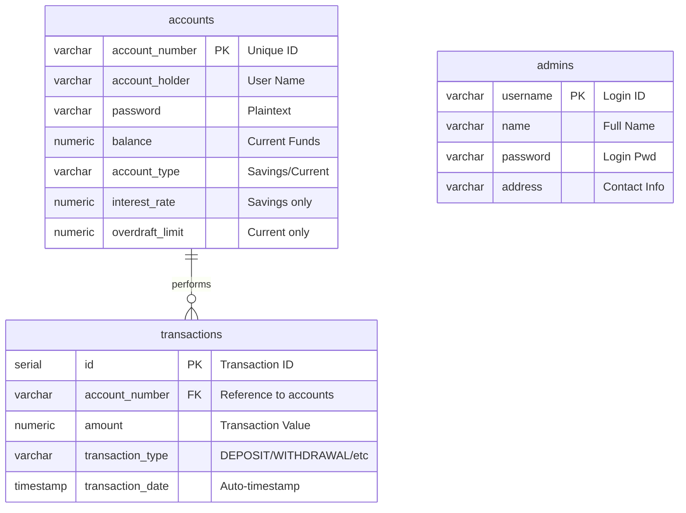

# Database Report: Bank Account Management System

## 1. Overview
This report provides a detailed technical overview of the PostgreSQL database structure used in the Bank Account Management application. The system uses a relational database named `bank_db` to persist user accounts, administrative credentials, and transaction history.

## 2. Entity Relationship Diagram (ERD)

---

## 3. Data Dictionary

### 3.1 Table: `accounts`
Stores all customer bank account information. It uses a **Single Table Inheritance** pattern to store different account types.

| Column | Data Type | Constraints | Description |
| :--- | :--- | :--- | :--- |
| `account_number` | VARCHAR | PRIMARY KEY | Unique identifier for each bank account. |
| `account_holder` | VARCHAR | NOT NULL | The name of the account owner. |
| `password` | VARCHAR | NOT NULL | The user's login password. |
| `balance` | NUMERIC | DEFAULT 0.0 | Current available balance. |
| `account_type` | VARCHAR | NOT NULL | Discriminator: 'Savings' or 'Current'. |
| `interest_rate` | NUMERIC | | Annual interest rate (applied to Savings accounts). |
| `overdraft_limit`| NUMERIC | | Credit limit (applied to Current accounts). |

### 3.2 Table: `admins`
Stores credentials and details for administrative staff.

| Column | Data Type | Constraints | Description |
| :--- | :--- | :--- | :--- |
| `username` | VARCHAR | PRIMARY KEY | Unique identifier for admin login. |
| `name` | VARCHAR | NOT NULL | Admin's full name. |
| `password` | VARCHAR | NOT NULL | Admin's login password. |
| `address` | VARCHAR | | Physical or contact address of the admin. |

### 3.3 Table: `transactions`
Logs every financial activity for auditing and history tracking.

| Column | Data Type | Constraints | Description |
| :--- | :--- | :--- | :--- |
| `id` | SERIAL | PRIMARY KEY | Auto-incrementing transaction index. |
| `account_number` | VARCHAR | FOREIGN KEY | References `accounts(account_number)`. |
| `amount` | NUMERIC | NOT NULL | The decimal value of the transaction. |
| `transaction_type`| VARCHAR | NOT NULL | One of: `DEPOSIT`, `WITHDRAWAL`, `TRANSFER-IN`, `TRANSFER-OUT`. |
| `transaction_date`| TIMESTAMP | DEFAULT NOW() | Date and time when the transaction occurred. |

---

## 4. Key Database Operations

The following SQL patterns are implemented in the `Bank.java` logic:

*   **Account Discovery**: `SELECT * FROM accounts WHERE account_number = ?`
*   **Balance Synchronization**: `UPDATE accounts SET balance = ? WHERE account_number = ?`
*   **Fund Transfer**: Wrapped logic that updates two rows in the `accounts` table and inserts two records into the `transactions` table.
*   **Reporting Queries**:
    *   *Total Bank Liquidity*: `SELECT SUM(balance) FROM accounts`
    *   *Daily Audit*: `SELECT * FROM transactions WHERE transaction_date::date = CURRENT_DATE`

---

## 5. Security & Integrity Observations

> [!WARNING]
> **Data Privacy**: Passwords for both users and admins are currently stored in **plaintext**. It is highly recommended to implement salted hashing (e.g., BCrypt).

> [!IMPORTANT]
> **Transaction Integrity**: The current Java implementation handles transfers by calling multiple update methods. In a production environment, these should be wrapped in an **SQL Transaction (BEGIN/COMMIT)** to ensure atomicity in case of system failure mid-transfer.

---

## 6. Recommendations
1.  **Add Constraints**: Implement `CHECK` constraints on the `balance` column to prevent negative values unless it's a `CurrentAccount` within its `overdraft_limit`.
2.  **Indexing**: Add an index on `transactions(transaction_date)` to optimize daily report queries as the log grows.
3.  **Normalization**: Consider moving common account fields to a base table if more complex account types are added in the future.
